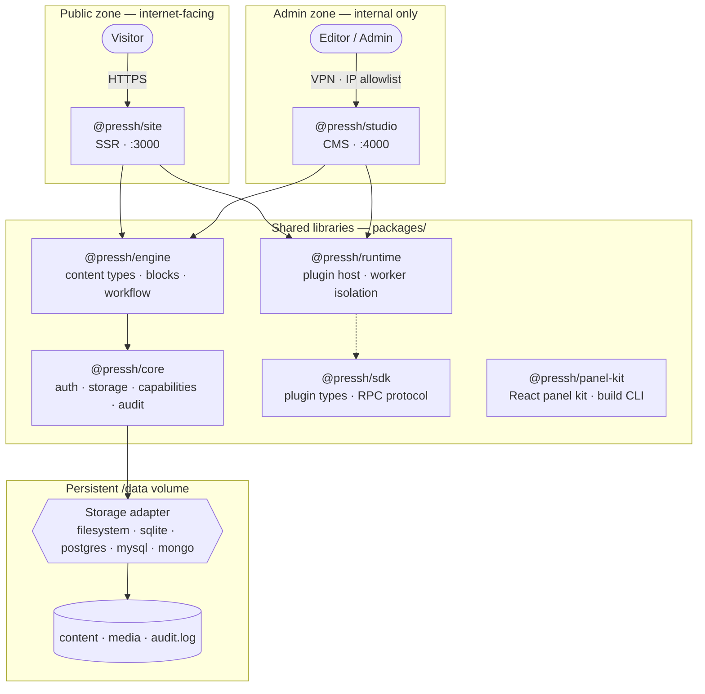
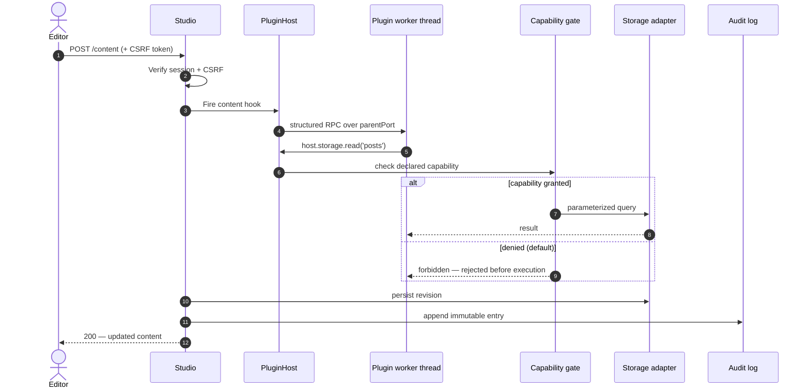
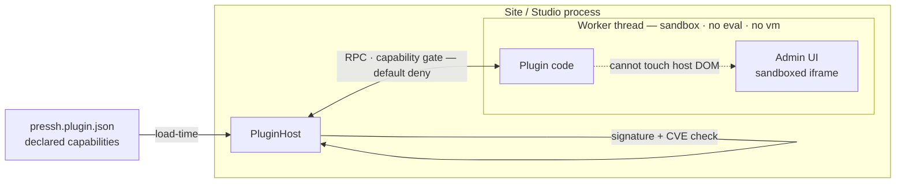
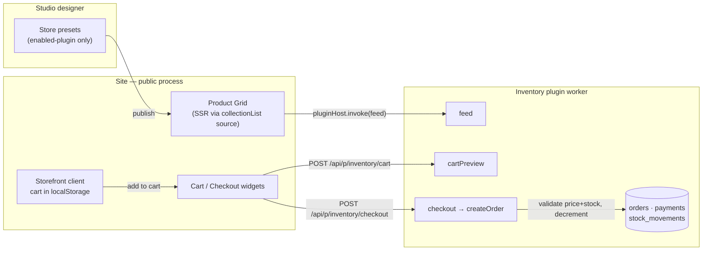
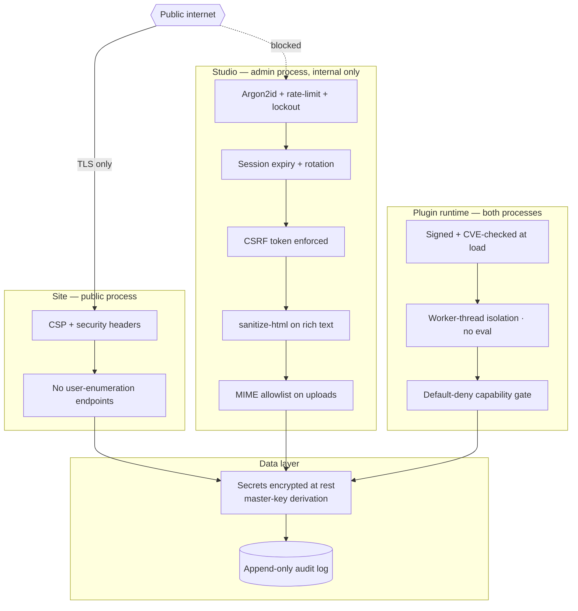

# Pressh

**Secure-by-default, no-code, self-hosted CMS — built for the post-WordPress era.**

Pressh is a TypeScript-native content management system that treats security as a first-class architectural concern, not an afterthought. Every plugin runs in an isolated worker thread. Every capability is denied by default. Every mutation lands in an immutable audit log. No PHP. No RCE surface.

---

## Why Pressh?

WordPress powers 43% of the web and is responsible for a disproportionate share of CMS-related breaches. The failure modes are structural: plugins execute in-process with full application privileges, SQL queries are hand-rolled across thousands of third-party packages, and the admin UI is reachable from the same domain as public content.

Pressh eliminates each of these by design:

| WordPress failure mode | Pressh mitigation |
|---|---|
| Plugin RCE (in-process execution) | All plugins run in sandboxed Node worker threads |
| SQL injection via plugin code | Parameterized adapters; plugins have no DB access |
| Admin credential brute-force | Argon2id + rate-limit + account lockout |
| File-upload RCE | MIME validation + strict type allowlist |
| REST user enumeration | No public user endpoints |
| XSS via rich-text fields | sanitize-html on every block save |
| CSRF on admin mutations | Cryptographic CSRF tokens, enforced centrally |

---

## Feature Overview

- **Visual content modeling** — define custom content types with 10+ field types (text, rich text, number, boolean, date, media, reference, repeater, select, sensitive)
- **Block-based page builder** — drag-and-drop block composition with sanitized XSS-safe rendering
- **Content workflow** — Draft → In Review → Scheduled → Published → Archived state machine with role-gated transitions
- **Immutable revision history** — every save creates a timestamped, restorable snapshot
- **Multi-user roles** — Owner, Admin, Editor, Author, Viewer with granular capability gating
- **Plugin system** — TypeScript-native plugins with declarative capability manifests, isolated in worker threads
- **Plugin-contributed widgets** — plugins can add their own drag-and-drop blocks to the page designer; they appear in
  the palette only while the plugin is enabled
- **Commerce / storefront** — the built-in Inventory plugin is a full store: product catalog with variants, categories,
  an audited stock ledger, orders, returns, and recorded payments — plus drag-in Store widgets (product grid, cart,
  checkout) that render server-side and place real orders (see [Store](#store-e-commerce))
- **i18n** — per-locale content variants out of the box
- **GDPR-native** — data-subject export, erasure, consent tracking, and retention policies built into v1
- **Observability** — structured Pino logging (with redaction), Prometheus metrics, request-ID tracing, immutable audit log
- **Flexible storage** — filesystem + SQLite by default; switch to SQLite, PostgreSQL, MySQL/MariaDB, or MongoDB from
  Studio → Database (no-downtime-window migration with backup, verify, and auto cut-over)
- **Two-process architecture** — Studio (admin) and Site (public) run as separate OS processes; compromise of the public site cannot touch admin data

---

## Architecture



**Two-process trust split:** Studio and Site are independent server processes sharing only a volume. In production, Studio should never be reachable from the public internet.

### Communication & plugin RPC

How an admin mutation flows through the system — session and CSRF checks, plugin hooks gated by capability,
parameterized storage, and an immutable audit entry:



### Plugin isolation

Every plugin runs in its own worker thread, reached only through a capability-gated RPC bridge. Its admin UI is confined
to a sandboxed iframe that cannot touch the host DOM.



Plugins declare their capabilities in `pressh.plugin.json`. Any call beyond the granted set is rejected before execution.

---

## Getting Started

### Prerequisites

- Node.js 24+
- Docker (optional, for containerized deployment)

### Local development

```bash
git clone https://github.com/your-org/pressh.git
cd pressh

npm ci
npm run build
npm run tests
```

Start both apps with a single command (Studio on port 4000, Site on port 3000):

```bash
npm start
```

Need just one process? Use `npm run studio` or `npm run site` (build first with `npm run build`).

`npm run build` produces a **self-contained standalone build in `.pressh/`** (the same
idea as Next.js's `.next/`): the two server bundles with their dependencies inlined, the
signed built-in plugins, the native SQLite driver, the plugin-worker runtime, and an empty
`plugins/` folder for external plugins. Run the app entirely from that folder with:

```bash
npm run start:standalone   # launches both processes from .pressh/
```

This is what the Docker image ships and runs (see Deployment).

Open Studio at `http://localhost:4000` to create your first content type.

---

## Deployment

Pressh is a **long-running, stateful server** — not a serverless app. It needs a host that
runs persistent Node processes and a **persistent disk**. Serverless platforms (Vercel,
Netlify Functions, Cloudflare Workers) are not supported: the plugin runtime relies on
long-lived worker threads, and content, media, and the audit log are written to disk.

Every deployment target below shares the same three requirements:

**1. Two processes, one trust boundary (ADR-002).** Site (`:3000`, public) and Studio
(`:4000`, admin) run as separate processes. **Studio must never be reachable from the public
internet** — firewall the port and/or front it with a reverse proxy + IP allowlist.

**2. A persistent `/data` volume.** Content, uploaded media, and the audit log live on disk
under `PRESSH_CONTENT_ROOT` and `PRESSH_MEDIA_ROOT`. Both processes share it. Back it up.

**3. Two secrets.** Required when `NODE_ENV=production`:

| Secret               | Purpose                               |
|----------------------|---------------------------------------|
| `PRESSH_MASTER_KEY`  | seals the secrets vault (AES-256-GCM) |
| `PRESSH_CSRF_SECRET` | signs CSRF tokens                     |

**The Docker image generates both on first boot if you don't supply them**, persisting
them under `/data/secrets` (`0600`) so Site and Studio share the same key automatically —
no manual step for the container deploys (Options B and D). To manage them yourself
(or for the non-Docker Option A), generate each one and set it on **both** processes:

```bash
# Run twice — once per secret
node -e "console.log(require('crypto').randomBytes(32).toString('hex'))"
```

> Keep `PRESSH_MASTER_KEY` **stable for the life of a deployment** — it decrypts your vault
> (SMTP credentials, plugin secrets, and the database connection string). If it changes,
> that data is unrecoverable. Include `/data/secrets` in your `/data` backups.

| Variable               | Purpose                                                       | Default                  |
|------------------------|---------------------------------------------------------------|--------------------------|
| `NODE_ENV`             | `production` enforces TLS, signed plugins, and the master key | `development`            |
| `PRESSH_MASTER_KEY`    | Encryption-vault seal (**required in prod**)                  | auto-generated in Docker |
| `PRESSH_CSRF_SECRET`   | CSRF token signing (**required in prod**)                     | auto-generated in Docker |
| `PRESSH_CONTENT_ROOT`  | Content + audit log directory                                 | `./data/content`         |
| `PRESSH_MEDIA_ROOT`    | Uploaded media directory                                      | `./data/media`           |
| `PRESSH_SITE_PORT`     | Public site port                                              | `3000`                   |
| `PRESSH_STUDIO_PORT`   | Admin studio port                                             | `4000`                   |
| `PRESSH_BUILTINS_DIR`  | First-party plugins dir                                       | `./builtins` (cwd)       |
| `PRESSH_PLUGINS_DIR`   | External plugins drop-in dir                                  | _unset_ (none loaded)    |
| `PRESSH_WORKER_SCRIPT` | Plugin-worker entry (scopes the sandbox fs-read grant)        | runtime's `worker-entry` |

> The last three are set automatically by `npm run start:standalone` and the Docker image to
> point at the `.pressh/` bundle. Set them yourself only for a hand-rolled standalone deploy.


Both processes expose `GET /healthz` (liveness) and `GET /readyz` (readiness) for health checks.

---

### Option A — Self-hosted, no Docker

For a VM or bare-metal host with Node.js 24+ installed.

```bash
git clone https://github.com/your-org/pressh.git
cd pressh

npm ci
npm run build          # compiles, signs built-in plugins, and assembles .pressh/
```

Export the environment and storage roots, then start both processes from the standalone
build:

```bash
export NODE_ENV=production
export PRESSH_MASTER_KEY=<32-byte hex>
export PRESSH_CSRF_SECRET=<32-byte hex>
export PRESSH_CONTENT_ROOT=/var/lib/pressh/content
export PRESSH_MEDIA_ROOT=/var/lib/pressh/media

npm run start:standalone   # launches Site (:3000) and Studio (:4000) from .pressh/
```

For production, run each process under `systemd` so they restart on failure and survive
reboots. Create `/etc/pressh.env` with the variables above, then two units:

```ini
# /etc/systemd/system/pressh-site.service
[Unit]
Description=Pressh Site (public)
After=network.target

[Service]
WorkingDirectory=/opt/pressh
EnvironmentFile=/etc/pressh.env
Environment=PRESSH_BUILTINS_DIR=/opt/pressh/.pressh/builtins
Environment=PRESSH_PLUGINS_DIR=/opt/pressh/.pressh/plugins
Environment=PRESSH_WORKER_SCRIPT=/opt/pressh/.pressh/site/runtime/worker-entry.js
ExecStart=/usr/bin/node /opt/pressh/.pressh/site/server.js
Restart=on-failure
User=pressh

[Install]
WantedBy=multi-user.target
```

```ini
# /etc/systemd/system/pressh-studio.service
[Unit]
Description=Pressh Studio (admin)
After=network.target

[Service]
WorkingDirectory=/opt/pressh
EnvironmentFile=/etc/pressh.env
Environment=PRESSH_BUILTINS_DIR=/opt/pressh/.pressh/builtins
Environment=PRESSH_PLUGINS_DIR=/opt/pressh/.pressh/plugins
Environment=PRESSH_WORKER_SCRIPT=/opt/pressh/.pressh/studio/runtime/worker-entry.js
ExecStart=/usr/bin/node /opt/pressh/.pressh/studio/server.js
Restart=on-failure
User=pressh

[Install]
WantedBy=multi-user.target
```

```bash
sudo systemctl enable --now pressh-site pressh-studio
```

Front the **site** with a reverse proxy for TLS (Caddy auto-provisions certificates):

```caddy
yourdomain.com {
    reverse_proxy localhost:3000
}
```

Keep **Studio off the public internet** — do not proxy port 4000. Reach it over a VPN, an
SSH tunnel (`ssh -L 4000:localhost:4000 host`), or a reverse proxy locked to your office IP.

---

### Option B — Self-hosted with Docker

The repo ships a [`Dockerfile`](./Dockerfile) and [`docker-compose.yml`](./docker-compose.yml)
that run Site and Studio as two services sharing a named volume. This is the simplest
production setup on a single host. The image is built in two stages and ships **only the
`.pressh/` standalone bundle** (no source tree, no dev dependencies, no package manager) —
a small, self-contained runtime, the Next.js `standalone` model.

```bash
docker compose up -d --build
```

That's the whole setup — the container **auto-generates `PRESSH_MASTER_KEY` and
`PRESSH_CSRF_SECRET` on first boot** and persists them under the shared `/data` volume, so
both services use the same key with no manual step. To manage the keys yourself, run
`cp .env.example .env`, fill them in, and Compose passes them through (a supplied value
overrides the generated one).

**Run the published image instead of building.** Every release pushes an image to GitHub
Container Registry (see [CI/CD → Releases](#releases)). Pull a tagged image directly:

```bash
docker pull ghcr.io/your-org/pressh:latest
```

or point Compose at it by replacing `build: .` with `image: ghcr.io/your-org/pressh:<version>`
on both services.

| Service  | Port   | Exposure                                                   |
|----------|--------|------------------------------------------------------------|
| `site`   | `3000` | Published to the host                                      |
| `studio` | `4000` | `expose`d on the internal network only — **not** published |

The compose file mounts a `pressh-data` volume at `/data` for both services and sets
`NODE_ENV=production`. Studio is intentionally not port-mapped to the host; put a reverse
proxy + IP allowlist in front of it before exposing it anywhere (see
[`RUNBOOK-pressh.md`](docs/RUNBOOK-pressh.md)).

Health, logs, and shutdown:

```bash
docker compose ps                  # health status of both services
docker compose logs -f site        # follow site logs
docker compose down                # stop (volume is preserved)
```

---

### Option C — Railway

Railway gives the closest push-to-deploy experience while keeping the architecture intact.
Run **both processes in one service** with a single attached volume — Railway volumes bind to
one service, so this preserves the shared `/data` disk.

1. **New Project → Deploy from GitHub repo**, select this repo. Railway detects the
   [`Dockerfile`](./Dockerfile) and builds from it.
2. **Settings → Deploy → Custom Start Command:** `node /app/run-standalone.mjs`
   (the supervisor bundled into the standalone image — launches Site and Studio together).
3. **Variables:** add `NODE_ENV=production`, `PRESSH_MASTER_KEY`, `PRESSH_CSRF_SECRET`,
   `PRESSH_CONTENT_ROOT=/data/content`, `PRESSH_MEDIA_ROOT=/data/media`,
   and `PRESSH_SITE_PORT=3000`.
4. **Storage → Add Volume**, mount path `/data`.
5. **Settings → Networking:** generate a public domain and set the target port to `3000`
   (the public site). Leave Studio's `4000` unpublished — reach it via Railway private
   networking or a TCP proxy locked down to you.
6. Set the healthcheck path to `/healthz`.

> Note: a single Railway volume cannot be shared across two separate services, so the
> two-process split runs as two processes inside one container here rather than two
> containers. The trust boundary (Studio not publicly routed) is still enforced.

---

### Option D — Hetzner (VPS)

A Hetzner Cloud server (or any VPS) running the Docker setup from **Option B**, hardened with
a firewall and TLS.

```bash
# On a fresh Ubuntu/Debian server, as root or with sudo:
apt-get update && apt-get install -y docker.io docker-compose-plugin git
git clone https://github.com/your-org/pressh.git /opt/pressh
cd /opt/pressh
# Secrets auto-provision on first boot; to set your own: cp .env.example .env

docker compose up -d --build
```

Lock down the firewall so only the public site and SSH are reachable — **block Studio's port**:

```bash
ufw allow OpenSSH
ufw allow 80/tcp
ufw allow 443/tcp
ufw deny 4000/tcp        # Studio: never public
ufw enable
```

Terminate TLS with a reverse proxy on the host (Caddy shown; nginx works too):

```caddy
yourdomain.com {
    reverse_proxy localhost:3000
}
```

Reach Studio over an SSH tunnel from your machine, keeping it entirely off the public net:

```bash
ssh -L 4000:localhost:4000 user@your-server   # then open http://localhost:4000
```

For backups, snapshot the `pressh-data` Docker volume (or the Hetzner block volume backing
it) on a schedule, and store snapshots off-host. See
[`RUNBOOK-pressh.md`](docs/RUNBOOK-pressh.md) for backup/restore procedures.

---

## Storage Configuration

Pressh defaults to filesystem storage with a SQLite index — no external database required.

| Adapter | Config | When to use |
|---|---|---|
| Filesystem + SQLite | *(default)* | Single-server, small–medium sites |
| PostgreSQL | `PRESSH_DB_URL=postgres://...` | High-concurrency, horizontal scaling |
| MongoDB | `PRESSH_DB_URL=mongodb://...` | Document-heavy content models |

All adapters implement the same `StorageAdapter` interface and pass the shared conformance test suite.

---

## Plugin Development

1. Create a plugin directory with a manifest:

```jsonc
// my-plugin/pressh.plugin.json
{
  "name": "my-plugin",
  "version": "1.0.0",
  "main": "index.mjs",
  "capabilities": ["storage.read:posts", "network.fetch:api.example.com"],
  "endpoints": [{ "method": "POST", "path": "/sync", "handler": "sync" }],
  "panel": { "title": "My Plugin", "entry": "panel.js" },
  "panelActions": ["sync"]
}
```

2. Implement the handlers using the SDK. Each runs in an isolated worker; the only host access is the capability-gated
   `HostApi`:

```typescript
import type { HostApi } from "@pressh/sdk";

export async function sync(args: unknown, host: HostApi): Promise<unknown> {
  const { items } = await host.storage.query("posts", { status: "published" });
  return { count: items.length };
}
```

3. Drop the plugin folder into `plugins/` — Pressh loads it on next restart.

Capabilities not listed in the manifest are rejected at the RPC boundary. A panel may only invoke the handlers named in
`panelActions` (default-deny). The admin panel runs in a sandboxed iframe; it cannot touch the host DOM or parent
window.

### Admin panels in React + TypeScript

Author panels in React + TypeScript with **`@pressh/panel-kit`** — plugins ship **no HTML**. The kit gives you a typed
host bridge (`request`), a data hook (`usePanelQuery`), and a `mountPanel` helper. Its `pressh-build-panel` CLI bundles
your `main.tsx` into a single self-contained `panel.js` (React and your CSS inlined into the one script); the Studio
generates the surrounding iframe document and inlines the bundle. This is required because the panel iframe is
opaque-origin under a strict CSP (`script-src 'unsafe-inline'`, no `'self'`), so an external `<script src>` can't load.

```tsx
// panel-src/main.tsx
import { StrictMode } from "react";
import { mountPanel } from "@pressh/panel-kit";
import { App } from "./App";
import "./styles.css";

mountPanel(<StrictMode><App /></StrictMode>);
```

```tsx
// panel-src/App.tsx
import { request, usePanelQuery } from "@pressh/panel-kit";

export function App() {
  // usePanelQuery: loading / error / data + reload, over the host bridge.
  const { data, loading, error, reload } = usePanelQuery<{ count: number }>("sync");
  if (loading) return <p>Loading…</p>;
  if (error) return <p>Error: {error}</p>;
  // request(action, payload): `action` MUST be listed in the manifest's panelActions.
  return (
    <div>
      <p>{data?.count} posts</p>
      <button type="button" onClick={() => request("sync").then(reload)}>Re-sync</button>
    </div>
  );
}
```

Build it (writes `panel.js` next to your manifest):

```bash
npx pressh-build-panel panel-src/main.tsx --out panel.js
```

Keep panel source **outside** the shipped/signed plugin folder — only the built `panel.js` is signed and loaded. A
complete working example lives in [`plugins/hello`](plugins/hello): source under `panel-src/` (with its own
`tsconfig.json`), the built `panel.js`, and a manifest declaring `panelActions`. Rebuild it with
`npm run build:hello`.

### Built-in plugins

Pressh ships five first-party plugins in `builtins/` — same security model as any plugin (own worker, declared capabilities, signed at build). **All ship disabled**; enable only what you need from **Studio → Plugins** so the app stays lean. A disabled plugin spawns no worker at all.

| Plugin                | What it does                                                                                                                                                                            | Capabilities                                                                                                                                                                                              |
|-----------------------|-----------------------------------------------------------------------------------------------------------------------------------------------------------------------------------------|-----------------------------------------------------------------------------------------------------------------------------------------------------------------------------------------------------------|
| **DB** (Data Manager) | Read-only data browser + JSON export. No raw queries.                                                                                                                                   | `storage.read:*`                                                                                                                                                                                          |
| **Inventory / Store** | Full e-commerce: catalog (variants, categories, audited stock ledger), orders, returns, recorded payments, and drag-in storefront widgets. Public endpoints under `/api/p/inventory/*`. | `storage.read/write` on `inventory_items`, `inventory_categories`, `inventory_stock_movements`, `inventory_orders`, `inventory_returns`, `inventory_payments`, `inventory_counters`, `inventory_settings` |
| **Forms**             | Submissions → `form_submissions` (GDPR-linked); honeypot + per-IP rate limit.                                                                                                           | `storage.read/write:form_submissions`                                                                                                                                                                     |
| **SEO**               | Per-page + site meta/OpenGraph tags injected into the public `<head>`.                                                                                                                  | `storage.read/write:seo_meta`                                                                                                                                                                             |
| **Analytics**         | Cookieless server-side page-view counts. No cookies, IPs, or third parties.                                                                                                             | `storage.read/write:analytics_daily`                                                                                                                                                                      |

Auth-critical collections (`users`, `sessions`, `invites`) are off-limits to every plugin. The built-ins' panels are
authored in React + TypeScript under `panels/<plugin>/` and bundled into `builtins/<plugin>/panel.js` by
`npm run build:panels` (the same `@pressh/panel-kit` pipeline third-party authors use). After editing a built-in's panel
source re-run `npm run build:panels` then `npm run sign:builtins`; after editing its worker code just re-run
`npm run sign:builtins`. Both run as part of `npm run build`.

---

## Store (e-commerce)

The built-in **Inventory** plugin turns Pressh into a self-hosted store — with the same security model as any plugin (
own worker, declared capabilities, all data in plugin-owned collections, never the engine's content store). Enable it
from **Studio → Plugins**.

- **Catalog** — products with option axes + variants (per-variant SKU/price/stock), categories, multiple images, tags,
  slug/SEO, compare-at price.
- **Stock** — an *audited ledger*: every change is a movement (`receive`/`adjust`/`set`/`sell`/`return`/`correction`)
  with a running balance and a negative-stock guard; low-stock thresholds flag depleted variants.
- **Orders / returns / payments** — server-authoritative orders (pricing + stock validated server-side), a status
  lifecycle, returns that restock and refund, and **recorded payments** behind a pluggable `PaymentGateway` seam (only a
  no-network `manual` gateway ships today).
- **Storefront widgets** — Product Grid, Featured, Cart Button, Cart, Checkout, and Add-to-Cart appear in the page
  designer **only while the plugin is enabled**. Product grids render server-side (SEO-friendly); the cart lives in
  `localStorage` and checkout places a real order. Prices and stock are always re-validated server-side, so a client can
  never set its own price or oversell.

Customer flow — designer page → server-rendered product grid → client cart → server-validated checkout → order +
payment + stock ledger:



Public storefront endpoints (rate-limited, published-only, capability-gated like any plugin endpoint):

| Endpoint                         | Purpose                                                   |
|----------------------------------|-----------------------------------------------------------|
| `GET /api/p/inventory/items`     | Published, in-stock product feed (safe projection)        |
| `POST /api/p/inventory/products` | Filter/sort product feed (category, tag, search)          |
| `POST /api/p/inventory/cart`     | Re-price a cart authoritatively; flags out-of-stock lines |
| `POST /api/p/inventory/checkout` | Place an order (validates + decrements stock)             |

> **Payments are recorded, not charged.** No payment gateway ships in v1 — `recordPayment`/`refundPayment` keep a ledger
> and an order's payment status. A real processor implements the same `{ charge, refund }` shape behind the
`PaymentGateway` seam without touching the rest of the system.

---

## Security Baselines

Pressh ships with 14 security baselines enforced by `tests/security-baselines.test.ts`. The
defenses are layered across the trust boundaries — public site, admin studio, plugin runtime,
and data layer:



1. Argon2id password hashing (no MD5/bcrypt/SHA-1)
2. CSRF tokens on all admin mutations
3. Rate limiting + account lockout on login
4. Worker-thread plugin isolation (no `eval`, no `vm.runInThisContext`)
5. Default-deny capability gate
6. Sanitize-html on all rich-text block saves
7. MIME-type allowlist on media uploads
8. No public user-enumeration endpoints
9. Immutable audit log (append-only, no delete API)
10. Strict Content-Security-Policy headers
11. CVE feed checked at plugin load time
12. Session expiry + rotation on privilege change
13. Secrets encrypted at rest via master-key derivation
14. Studio port never referenced from Site process

---

## Testing

```bash
# All tests
npm run tests

# Single package
npm test --workspace=packages/engine

# Security baselines only
npx vitest run tests/security-baselines.test.ts

# E2E
npx vitest run tests/e2e.test.ts
```

The adapter conformance suite (`adapters/conformance.ts`) runs against all three backends — SQLite, PostgreSQL, and MongoDB — to guarantee identical behaviour across storage layers.

---

## CI/CD

GitHub Actions runs on every push to `main`/`dev` and all PRs ([`ci.yml`](.github/workflows/ci.yml)):

| Job                | Steps                                                                          |
|--------------------|--------------------------------------------------------------------------------|
| **build-and-test** | `npm ci` → `npm run build` → `npm run tests` → `npm run lint`                  |
| **security**       | `npm ci` → `npm audit --audit-level=high` → SBOM (CycloneDX) → secret scanning |

### Releases

Pushes to `main` also run the **Release** workflow ([`release.yml`](.github/workflows/release.yml)),
driven by [release-please](https://github.com/googleapis/release-please):

1. It maintains a **Release PR** that bumps the version in `package.json` and updates
   `CHANGELOG.md` from your [Conventional Commit](https://www.conventionalcommits.org/) messages
   (`fix:` → patch, `feat:` → minor, `feat!:` / `BREAKING CHANGE` → major).
2. Merging that PR tags `vX.Y.Z` and publishes a **GitHub Release**.
3. That release builds and pushes the Docker image to GitHub Container Registry:

   ```text
   ghcr.io/<owner>/pressh:X.Y.Z
   ghcr.io/<owner>/pressh:X.Y
   ghcr.io/<owner>/pressh:latest
   ```

The image build authenticates with the built-in `GITHUB_TOKEN` — no registry secrets to
configure. Two repo prerequisites: enable **Settings → Actions → General → "Allow GitHub
Actions to create and approve pull requests"** so release-please can open its PR, and write
Conventional Commit messages (non-conventional commits produce no version bump). The first
published package is **private** — make it public in the package settings for anonymous pulls.

---

## Observability

| Signal | Where |
|---|---|
| Structured logs | stdout (Pino JSON); sensitive keys auto-redacted |
| Prometheus metrics | `GET /metrics` on both apps |
| Health check | `GET /healthz` |
| Readiness check | `GET /readyz` |
| Audit log | Append-only file at `$PRESSH_CONTENT_ROOT/audit.log` |

---

## Operations

The Studio CLI is bundled into the standalone build at `.pressh/studio/cli.js`. In a Docker
deployment run it inside the container, e.g.
`docker compose exec studio node /app/studio/cli.js backup --out /data/backups/db.tar.gz`.

### Backup and restore

```bash
# Create a backup
node .pressh/studio/cli.js backup --out ./backups/$(date +%Y%m%d).tar.gz

# Restore
node .pressh/studio/cli.js restore --file ./backups/20260101.tar.gz
```

### GDPR requests

```bash
# Export all data for a subject
node .pressh/studio/cli.js gdpr export --subject user@example.com

# Erase all data for a subject
node .pressh/studio/cli.js gdpr erase --subject user@example.com
```

---

## Documentation

Full design and architecture documents live in [`docs/`](./docs/):

| Document                                                          | Description                                            |
|-------------------------------------------------------------------|--------------------------------------------------------|
| [`SRS-pressh.md`](docs/SRS-pressh.md)                             | Software Requirements Specification (80+ requirements) |
| [`TDD-pressh.md`](docs/TDD-pressh.md)                             | Technical Design Document                              |
| [`SAD-pressh.md`](docs/SAD-pressh.md)                             | Security Architecture Document + threat model          |
| [`ADRs-pressh.md`](docs/ADRs-pressh.md)                           | Architecture Decision Records (14 ADRs)                |
| [`RUNBOOK-pressh.md`](docs/RUNBOOK-pressh.md)                     | Operations guide (deploy, scale, backup, troubleshoot) |
| [`SDR-pressh.md`](docs/SDR-pressh.md)                             | Security Design Review + control verification matrix   |
| [`IMPLEMENTATION-pressh.md`](docs/IMPLEMENTATION-pressh.md)       | Phase-by-phase build guide                             |
| [`architecture-pressh-v1.html`](docs/architecture-pressh-v1.html) | Interactive architecture dashboard                     |

---

## Tech Stack

| Layer             | Choice                                                                                  |
|-------------------|-----------------------------------------------------------------------------------------|
| Runtime           | Node.js 24 (ES modules)                                                                 |
| Language          | TypeScript 6.0 (strict)                                                                 |
| HTTP framework    | Hono 4.12                                                                               |
| Build             | TypeScript project refs + Vite 8.0 (client) + esbuild 0.28 (server bundle → `.pressh/`) |
| Testing           | Vitest 4.1                                                                              |
| Password hashing  | Argon2id                                                                                |
| Schema validation | Zod 4.4                                                                                 |
| Logging           | Pino 9.0                                                                                |
| Default storage   | Filesystem + better-sqlite3 12                                                          |
| Containers        | Docker + Compose                                                                        |

---

## License

MIT
